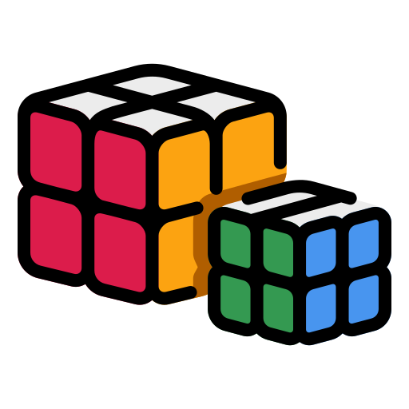

# SpeedCube

<p align="center">
  
</p>

A web-based Rubik's Cube simulator with timer, keybind customization, and leaderboard. Built with React and Three.js.

## Features

- **3D Rubik's Cube**: Interactive, animated cube rendered with Three.js.
- **Timer**: Track your solve times with millisecond precision.
- **Keybinds**: Fully customizable keyboard controls for all cube moves.
- **State Controls**: Shuffle, reset, and control the cube and timer.
- **Responsive UI**: Clean, modern interface styled with Tailwind CSS.

## Installation

1. Clone the repository:
```sh
git clone https://github.com/your-username/rubik-game.git
cd rubik-game
```

2. Install dependencies:
```sh
npm install
``` 

### Running the App

Start the development server:
```sh
npm start
```
Open [http://localhost:3000](http://localhost:3000) in your browser.

## Project Structure
```
src/
├── components/
│   ├── Keybinds/
│   │   ├── Keybinds.css
│   │   └── Keybinds.jsx
│   ├── StateControls/
│   │   ├── StateControls.css
│   │   └── StateControls.jsx
│   └── Cube.jsx
├── App.css
└── App.js
```

## Customization

- **Keybinds**: Change key assignments in the Keybinds panel. Settings are saved in your browser.

## License

This project is open source and available under the [MIT License](LICENSE)
